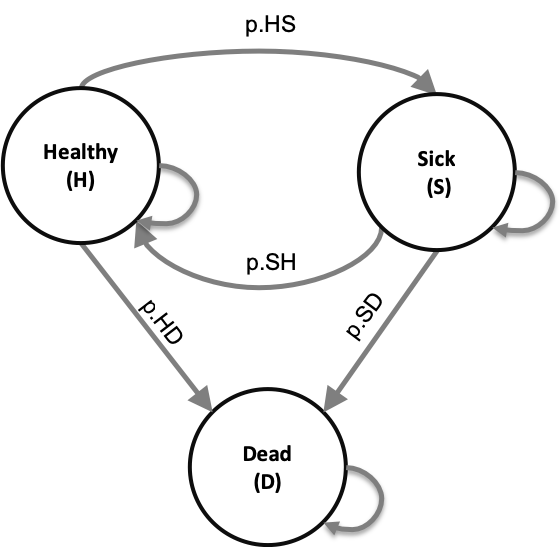

```{r setup, include=FALSE}
knitr::opts_chunk$set(echo = TRUE)
```

```{r, eval = TRUE, echo = FALSE}
###############################################################################
### A brief report   ## 2019 ##
################################################################################
# This code forms the basis for the brief report: 
# 'An alternative representation of state-transition model dynamics' 
# Please cite the article when using this code
################################################################################
# Demonstrate the array approach using the Sick-Sicker model with age dependent
# transition probabilities but without performing a cost-effectiveness analysis.
################################################################################
# To program this tutorial, we made use of 
# R version 3.5.1 (2018-7-02)
# Platform: x86_64-apple-darwin15.6.0 (64-bit)
# Running under: macOS Mojave 10.14
# RStudio: Version 1.1.456 2009-2018 RStudio, Inc
################################################################################
rm(list = ls())  # remove any variables in R's memory 
```

## Simple 3-state model
In this simple 3-state model, we simulate a hypothetical cohort of 70-year-old individuals over their remaining lifetime using 50 annual cycles. The cohort start out healthy. The healthy individuals can get sick or they can die. Sick individuals can recover (transitioning back to healthy), stay sick or die. Each health state is associated with utilities and costs. This are the state rewards. In addition to these state rewards, transition rewards apply. There is a sudden decrease of quality of life when just getting sick and the transition to dead is associated with a one-time cost. The state-transition diagram is shown in Figure \ref{fig:STM} and all model parameters are described in the table below. We use some prefixed to name our variables and we try to use a <x>.<y>.<varName> structure as consistent as possible, with x being the data type prefix, e.g. `a.` for arrays, `m.` for matrix, `df.` for data frames etc. and y being the variable type prefix, e.g. `c.` for costs, `p.` for probabilities, `u.` for utilities etc. 



|           **Parameter**            |  **R name** |   **Value**   |
|:-----------------------------------|:-----------:|:-------------:|
| Time horizon ($n_t$)               | `n.t`       |  30 years     |
| Names of health states ($n$)       | `v.n`       |  H, S, D      |
| Annual transition probabilities    |             |               |
| - Disease onset (H to S)           | `p.HS`      |  0.30         |
| - Recovery (S to H)                | `p.SH`      |  0.15         |
| Annual mortality                   |             |               |
| - All-cause (H to D)               | `p.HD`      |  0.05         |
| - Disease specific (S to D)        | `p.SD`      |  0.20         |
| Annual costs                       |             |               |
| - Healthy individuals              | `c.H`       |  $1,000       |
| - Sick individuals                 | `c.S`       |  $3,000       |
| - Dead individuals                 | `c.D`       |  $0           |
| Utility weights                    |             |               |
| - Healthy individuals              | `u.H`       |  1.00         |
| - Sick individuals                 | `u.S`       |  0.60         |
| - Dead individuals                 | `u.D`       |  0.00         |
| Transition rewards                 |             |               |
| - Utility decrement of healthy individuals | `du.HS`|  0.10      |
|   when transitioning to S          |             |               |
| - Cost of dying                    | `ic.D`      |  $4,000       |


###01 Initial setup 
We start by loading the packages and functions needed. 
```{r, eval = TRUE, echo = TRUE, message = FALSE, warning = FALSE}
#### 01.1 Load packages and functions ####
library(reshape2) # to transform data
library(ggplot2)  # for nice looking plots
#library(scales)   # for dollar signs and commas
#library(tensorA)  # for tensor calculations 
#library(dplyr)    # to manipulate data
```

#### 01.2 External parameters
In this section, we specify the staring age of the cohort, the number of cycles, the names of the health states and model parameters. These parameters, as described in the table, are combined in a data frame using the `f.generate_init_params` function. 
```{r, eval = TRUE, echo = TRUE, message = FALSE, warning = FALSE}
#### 01.2.1 General setup ####
age         <- 70  # age of starting cohort
n.t         <- 30  # time horizon, number of cycles
v.age.names <- age:(age + n.t - 1) # vector with age names
v.n <- c("H", "S", "D") # vector with the 3 health states of the model:
# Healthy (H), Sick (S), Dead (D)
n.states <- length(v.n) # number of health states 
```

```{r}
#### 01.2.3 Generate initial set of base-case external parameters ####
# Costs
c.H   = 1000   # cost of remaining one cycle healthy 
c.S   = 3000   # cost of remaining one cycle sick 
c.D   = 0      # cost of being dead (per cycle)
# State utilities
u.H   = 1      # utility when healthy 
u.S   = 0.60   # utility when sick 
u.D   = 0      # utility when healthy 
# Transition probabilities (per cycle)
p.HS  = 0.30   # probability to become sick when healthy
p.HD  = 0.05   # probability to die when healthy
p.SH  = 0.15   # probability to become healthy when sick
p.SD  = 0.20   # probability to die when healthy
# Transition rewards
du.HS  = 0.10  # one-time utility decrement when becoming sick
ic.D   = 4000   # one-time cost of dying

```

### 02 Define and initialize matrices and vectors ####
In this section, we initialize the matrices and vectors used for storing the data. The transition probability matrix, `m.P`, is initialized using the function `f.create_transition_prob_matrix` based on the parameter values stored in the `df.params.init` data frame. The next step is to initialize the state vector `v.m0`. All individuals start in the Healthy health state. This state vector is used to inform the first row of the cohort trace matrix `m.M`. 

#### Equation 1-4
```{r, message = FALSE, warning = FALSE}
#### 02.1 Transition probability matrix ####
# matrix m.P at the first cycle
m.P <- matrix(NA, 
                  nrow = n.states, ncol = n.states, 
                  dimnames = list(v.n, v.n))

# Fill in matrix
# From Healthy
m.P["H", "H"]  <- 1 - (p.HS + p.HD)
m.P["H", "S"]  <- p.HS
m.P["H", "D"]  <- p.HD
# From Sick
m.P["S", "H"]  <- p.SH
m.P["S", "S"]  <- 1 - (p.SH + p.SD)
m.P["S", "D"]  <- p.SD
# From Death
m.P["D", "H"]  <- 0
m.P["D", "S"]  <- 0
m.P["D", "D"]  <- 1

#### 02.2 Initial state vector ####
# the cohort start in the Healthy health state
v.m0 <- c(H = 1, S = 0, D = 0)
v.m0

#### 02.3 Cohort trace  
## Create the Markov cohort trace matrix m.M capturing the proportion of the cohort 
# in each state at each cycle

m.M <- matrix(0,  # initialize cohort trace
              nrow = (n.t + 1), ncol = n.states, 
              dimnames = list(0:n.t, v.n))

m.M[1, ] <- v.m0   # store the initial state vector
```
We have determined all parameters for the general set up, we specified our input parameters, initialized all structures and filled the transition probability matrix `m.P` and the first row of our cohort trace `m.M`. The next step is running the Markov model. 

### 03 Traditional cohort trace approach  
In this section, we run the Markov model for all cycles. The calculation shown in Equation 3 needs to be performed for all cycles. Therefore, we create a loop starting at `t = 1` until `t = n.t`. The transition probability matrix, `m.P` is multiplied with the cohort trace `m.M[t, ]`, using matrix multiplication, specified in `R` with `%*%`, to fill the next row of the `m.M[t + 1, ]`. 

#### Equation 3 & 4   
```{r, message = FALSE, warning = FALSE}
for(t in 1:n.t){  # loop through the number of cycles
  # estimate the state vector for the next cycle (t + 1)
  m.M[t + 1, ] <- m.M[t, ] %*% m.P   # Equation 3   
}
```

When printing the first six rows of `m.M` we see that everyone starts in the Healthy health state and over time the cohort transitions towards sick and dead. 
```{r}
head(round(m.M, 3)) # show the first six lines of the Markov cohort trace
```
Running the model using equation 3, results in the traditional cohort trace. This gives us information about state occupation at each cycle. This allows us to apply state rewards (e.g. `c.H`, `u.H`, etc.), but it is not possible to include the transition rewards (e.g. `du.HS` and `ic.D`). In order to include these rewards, we need to know when individuals made the transition. The dynamics array approach facilitates this and will be explained in the next section. 

### 04 Dynamics array approach  
The dynamics array approach starts similar as the traditional cohort trace approach, meaning that the first two sections are identical for the two approaches. The biggest difference between the approaches is the dimensions of the structure to store the model dynamics. In the cohort trace approach, we stored all information in matrix `m.M` of size `n.states` x  `n.states`, while in the dynamics array approach we add the dimension time resulting in an array with dimensions `n.states` x `n.states` x `n.t`. In `R` indexing start at 1, therefore, we initialize the array `a.A` using `n.state` + 1. This allows us to store the results from cycle 0 until cycle `n.t`. The initial state vectors `v.m0` is used to inform the initial cycle of the array. 
```{r, message = FALSE, warning = FALSE}
a.A <- array(0, dim = c(n.states, n.states, n.t + 1),
             dimnames = list(v.n, v.n, 0:n.t)) # initialize array
diag(a.A[, , 1]) <- v.m0 # store the initial state vector in the diagonal of A
```

#### Equation 5-7 
We are now ready to run the model using the dynamics array approach. In this approach, iteratively over time, we multiply the transition probability matrix `m.P` with array `a.A` using element-wise multiplication, indicated with the `*` in `R`. The information about all transitions dynamics is stored in the next cycle in `a.A`.  
```{r, message = FALSE, warning = FALSE}
a.A[, , 1]

# run the model 
for(t in 1:n.t){                     # loop through the number of cycles
#### Equation 4    #### 
  a.A[, , t + 1] <- colSums(a.A[, , t]) * m.P  # fill array A for t + 1 
}
```

#### Equation 5  
By printing the first thee cycles of the dynamics array `a.A`, you can get an impression of the results. Like in the transition probability matrix `m.P`, the rows specify in which health state the individual started at the beginning of the cycle, while the columns inform you about where individuals transitioned to. In cycle 0 everyone started in the healthy health states. At cycle 1 we can see that the values look very similar to the transition probabilities. From cycle 2 and onwards the information in `a.A` becomes more interesting. In cycle 2, we see that `r a.A["H", "H", 2]` of the cohort stayed healthy, `r a.A["H", "S", 2]` transitioned from Healthy towards Sick and `r a.A["H", "D", 2]` of the population died. In addition, we see that `r a.A["S", "H", 2]` of the cohort recovered, `r a.A["S", "S", 2]` stayed Sick and `r a.A["H", "D", 2]` died from Sick. All these values sum to 1 since we are still describing what happens to the full cohort over time. 

```{r, message = FALSE, warning = FALSE}
a.A[, , 1:3] # shown for two cycles
sum(a.A[, , 3]) # sum for t = 3
```

#### Equation 8
When you sum the values in each column of `a.A`, the health states towards which the individuals transition to, you get which proportion of the cohort was in each health state for that cycle. The code below shows this for the health state sick. 
```{r}
sum(a.A[, "S", 3]) # sum the column of S at t = 3
```

By using the `colSums` function, summing the values in each column of `a.A`, we can do this for all points in time. By transposing this in turn, we get the traditional cohort trace `m.M`. We name this matrix, `m.M_A`, to indicate it is generated via the dynamics array approach and to make it possible toe compare it with the previously generated `m.M`. When you only do the dynamics array approach you can simply call it `m.M`. 
```{r, message = FALSE, warning = FALSE}
# calculating M from A 
m.MViaA <- t(colSums(a.A))   # sum over the columns of a.A and transpose 
```

Since a Markov model is stochastic, these two approached should give identical results. We check this using the `==` function. We use rounding on 10 decimals, to avoid wrong `FALSE` results that have to do with floating point comparison issues.

```{r, eval = FALSE, echo = FALSE}
round(m.M, 10) == round(m.MViaA, 10) # check if they are exactly the same
```


### 05 Apply state and transition rewards 
We now showed how to run a state-transition cohort model using the dynamics array approach and how to interpret or summarize the results. In this section, we demonstrate how to apply state and transition rewards. We start by initiating and filling two matrices for both costs and effects. To create the cost matrix we make use of the functions `f.create_transition_reward_matrix_costs`. This functions is informed by the `df.params.init` data frame, including all cost values. Running the function results in a reward matrix for costs, `m.R_costs`. On the diagonal are the costs for staying one cycle in that state, while the costs off the diagonal are the costs for staying one cycle in that state plus the transition cost associated with that transition. The function `f.create_transition_reward_matrix_effects` does the same but then for utilities. 

```{r, message = FALSE, warning = FALSE}
#### 05.1 Create reward matrices for both costs and effects #### 
m.R.costs <- m.R.effects <- matrix(NA, 
                  nrow = n.states, ncol = n.states, 
                  dimnames = list(v.n, v.n))
    
# Fill in matrix for costs
# From Healthy
m.R.costs["H", "H"]  <- c.H
m.R.costs["H", "S"]  <- c.H 
m.R.costs["H", "D"]  <- c.H + ic.D
# From Sick
m.R.costs["S", "H"]  <- c.S
m.R.costs["S", "S"]  <- c.S 
m.R.costs["S", "D"]  <- c.S + ic.D
# From Death
m.R.costs["D", "H"]  <- c.D
m.R.costs["D", "S"]  <- c.D
m.R.costs["D", "D"]  <- c.D 

# Fill in matrix for effects
# From Healthy
m.R.effects["H", "H"]  <- u.H
m.R.effects["H", "S"]  <- u.H - du.HS 
m.R.effects["H", "D"]  <- u.H 
# From Sick
m.R.effects["S", "H"]  <- u.S
m.R.effects["S", "S"]  <- u.S 
m.R.effects["S", "D"]  <- u.S + ic.D
# From Death
m.R.effects["D", "H"]  <- u.D
m.R.effects["D", "S"]  <- u.D
m.R.effects["D", "D"]  <- u.D 

```

#### Equation 11  
These rewards matrices look as follow. We see that staying healthy costs \$1000, while someone that transitions from healthy towards dead makes costs of \$5000. In the effects matrix we see that an individual gets a utility of 1 assign for staying healthy, while when the individual transitions towards Sick the decrement of `ic.HS` is included, resulting in a utility of 0.90.

```{r, message = FALSE, warning = FALSE}
m.R.costs    # show the reward matrix for costs
m.R.effects  # show the reward matrix for effects
```

#### Equation 12 
In this section we create outcome arrays, `a.Y`, one for costs, called `a.Y_costs`, and one for effects, called `a.Y_effects`. These arrays show the costs and QALYs generated with each transition at each cycle. By iteratively element-wise multiplication of the reward matrices, `m.R_costs` and `m.R_effects`, with array `a.A` we can fill the outcome arrays.
```{r, message = FALSE, warning = FALSE}
#### 05.2 Expected QALYs and Costs per cycle for each strategy ####
a.Y.costs <- a.Y.effects <- array(0, dim = c(n.states, n.states, n.t + 1),
             dimnames = list(v.n, v.n, 0:n.t))

for(t in 1:n.t){ 
# element-wise-multiplication of array A with the rewards matrices
a.Y.costs[, , t]   <- a.A[, , t] * m.R.costs   
a.Y.effects[, , t] <- a.A[, , t] * m.R.effects 
}
```

Please note that we are now showing all these steps in a step-wise approach, resulting in having a couple of loops for time. This iterative process can be combined within the same loop for time. 

#### Equation 13
The final step is to calculate the total costs and QALYs. We first calculate the expected cost and QALYs per cycle and store them in the vectors `v.Costs` and `v.QALYs`. Then, we sum the values within each vector to compute the total expected cost (`TC`) and QALYs (`TE`). 
```{r, message = FALSE, warning = FALSE}
# calculate the expected costs per cycle
v.costs <- rowSums(t(colSums(a.Y.costs))) 
# calculate the expected QALYs per cycle
v.QALYs <- rowSums(t(colSums(a.Y.effects))) 

TC <- sum(v.costs)  # calculate the total expected costs
TE <- sum(v.QALYs)  # calculate the total expected QALYS

v.results <- c(TC, TE)       # combine the total expected costs and QALYs
names(v.results) <- c("Costs", "Effect") # name the vector
v.results                    # print the results  
```


### 06 Plot cohort trace
The results of a cohort trace are much easier to interpret via a graph. Using the function `ggplot` we show the proportion of the cohort in each state (y-axis) at each cycle (x-axis) in Figure \ref{fig:cohort-trace}.
```{r cohort-trace, fig.width = 7, fig.height = 4, fig.align = 'center', fig.pos = "h", echo = FALSE, fig.cap = 'Cohort trace of the model', message = FALSE, warning = FALSE} 
ggplot(melt(m.M), aes(x = Var1, y = value, color = Var2)) +
  geom_line(size = 1.3) +
  scale_color_discrete(l = 50, name = "Health state", h = c(45, 365)) +
  xlab("Cycle") +
  ylab("Proportion of the cohort") +
  ggtitle("Cohort trace of the simple 3-state model")+
  theme_bw(base_size = 16) +
  scale_x_continuous(name = "Cycles", limits = c(0, n.t), breaks = seq(0, n.t, 10)) +
  theme()
```


