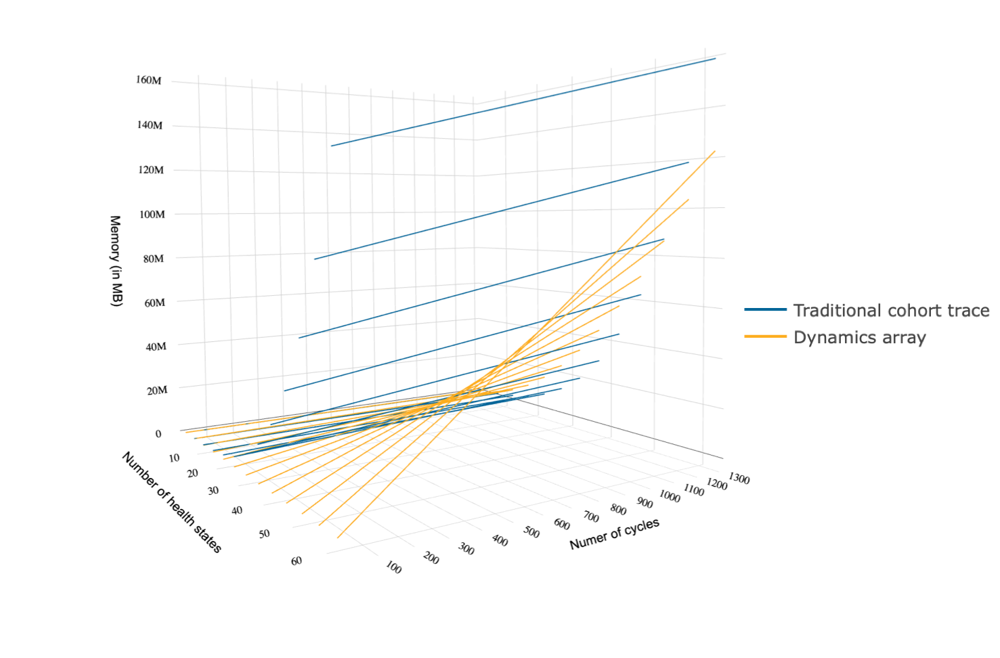

**Explanation of the simulation study**

For an explanation see the paper or Markdown document. This file only contains the code for the figures. 

##Compare time:

**2D line graph - by state, at 1320 cycles**

```{r, echo = FALSE, eval = TRUE, warning = FALSE, cache = TRUE, message = FALSE}
library(plotly)
library(ggplot2)
library(DataCombine)
library(darthpack)
library(dampack)
library(reshape2)

# code for the DARTH colors for the figures
DARTHgreen      <- '#009999'  
DARTHyellow     <- '#FDAD1E'  
DARTHblue       <- '#006699' 
DARTHlightgreen <- '#00adad'
DARTHgray       <- '#666666'

number_ticks <- function(n) {function(limits) pretty(limits, n)} #Function for number of ticks in ggplot

time_mem_both <- read.csv('time_memory_comparisions_avg_10sets.csv', 
                     header = TRUE, stringsAsFactors = FALSE)

time_mem_both$method[time_mem_both$method == "cohort trace"] <- "Traditional cohort trace"
time_mem_both$method[time_mem_both$method == "array"] <- "Dynamics array"
names(time_mem_both)[names(time_mem_both) == "method"] <- "Approach"
time_mem_both_2D <- time_mem_both[time_mem_both$n_t == 1320, ]

# Create a graph showing the computational time of both approaches
ggplot(data = time_mem_both_2D, aes(x = n_states, y = time, group = Approach)) +
  geom_point(aes(color = Approach, shape = Approach)) +
  geom_line(aes(color = Approach)) + 
  ggtitle("Computation time simulation analysis") +
  xlab("Number of health states") + 
  ylab("Time (in seconds)") +
  scale_color_manual(values = c(DARTHyellow, DARTHblue), name = "Approaches", labels = c("Dynamics array", "Traditional cohort trace")) +
  scale_color_manual(values = c(DARTHyellow, DARTHblue)) +
    theme_bw(base_size = 16) + theme(legend.position = "bottom")


ggsave("../figs/2D_time.png")
```


**Zoom in on the y-axis**

2D line graph - by state, at 1320 cycles zoomed in on the y-axis to see time changes of the array approach
```{r, echo = FALSE, eval = TRUE, warning = FALSE, cache = TRUE, message = FALSE}
# Create a graph to zoom in on the y-axis to see the change in time for the array method
ggplot(data = time_mem_both_2D, aes(x = n_states, y = time, group = Approach)) +
  geom_point(aes(color = Approach, shape = Approach)) +
  geom_line(aes(color = Approach)) + 
  ggtitle("Comparison of computation time (short y-axis)") +
  xlab("Number of health states") + 
  ylab("Time (in seconds)") +
   scale_y_continuous(limits = c(0, 2)) + 
    theme_bw(base_size = 16) +
    scale_x_continuous(breaks = number_ticks(6)) +
  scale_color_manual(values = c(DARTHyellow, DARTHblue)) +
    theme_bw(base_size = 16) + theme(legend.position = "bottom")

ggsave("../figs/2D_time_zoom.png")
```


**3D Scatter plot:**

```{r, echo = FALSE, eval = TRUE, warning = FALSE, cache = TRUE, message = FALSE, include = TRUE}
time_mem_both <- read.csv('time_memory_comparisions_avg_10sets.csv', 
                     header = TRUE, stringsAsFactors = FALSE)

time_mem_both_3D <- time_mem_both

# insert NAs so the lines are not connected on the graph
index <- 1:length(seq(from = 110, to = 2860, by = 110))
j <- 0
for (i in seq(from = 110, to = 2860, by = 110)) {
  j <- j + 1
  time_mem_both_3D <- InsertRow(time_mem_both_3D, rep(NA,5), RowNum = i + index[j])
}

axy <- list(
  nticks = 14,
  range = c(3, 1320)
)

f1 <- list(
  family = "Arial, sans-serif",
  size = 12,
  color = "black")

f2 <- list(
  family = "Old Standard TT, serif",
  size = 11,
  color = "black")

axis <- list(
  titlefont = f1,
  tickfont = f2,
  showgrid = TRUE
)

scene = list(
  xaxis = axis,
  yaxis = axis,
  zaxis = axis)

time_mem_trace <- time_mem_both_3D[time_mem_both_3D$method == 'cohort trace', ]
time_mem_array <- time_mem_both_3D[time_mem_both_3D$method == 'array', ]

p <- plot_ly(x = time_mem_trace$n_states, y = time_mem_trace$n_t, z = time_mem_trace$time, type = 'scatter3d', mode = 'lines', name = 'Traditional cohort trace', line = list(color = DARTHblue), connectgaps = FALSE) %>% layout(scene = list(yaxis=axy)) %>%
layout(scene = list(
       xaxis = list(title = "Number of health states"),
       yaxis = list(title = "Number of cycles"),
       zaxis = list(title = "Time (in seconds)"))) %>% layout(scene=scene)

p %>% add_trace(x = time_mem_array$n_states, y = time_mem_array$n_t, z = time_mem_array$time, type = 'scatter3d', mode = 'lines', name = 'Dynamics array', line = list(color = DARTHyellow), connectgaps = FALSE) 

```


##Compare storage:

**3D Scatter plot:**

```{r, echo = FALSE, eval = TRUE, warning = FALSE, cache = TRUE, message = FALSE, include = TRUE}
p1 <- plot_ly(x = time_mem_trace$n_states, y = time_mem_trace$n_t, z = time_mem_trace$memory, type = 'scatter3d', mode = 'lines', name = 'Traditional cohort trace', line = list(color = DARTHblue),  connectgaps = FALSE) %>% layout(scene = list(yaxis = axy)) %>%
layout(scene = list(
      xaxis = list(title = "Number of health states"),
      yaxis = list(title = "Numer of cycles"),
      zaxis = list(title = "Memory (in MB)"))) %>% layout(scene=scene)

p1 %>% add_trace(x = time_mem_array$n_states, y = time_mem_array$n_t, z = time_mem_array$memory, type = 'scatter3d', mode = 'lines', name = 'Dynamics array', line = list(color = DARTHyellow), connectgaps = FALSE) 

```


To save these figures we performed the following steps manually:

1. knit to html 

2. zoom in with html 

3. use printscreen button 

4. past it to paint (or powerpoint) 

5. crop 

6. save as png (and pdf) 


```{r, echo = FALSE, eval = TRUE, warning = FALSE, cache = TRUE, message = FALSE, out.width = '100%'}
# After saving the figure you can import it in the markdow

```


**2D line graph - by state, at 1320 cycles**

```{r, echo = FALSE, eval = TRUE, warning = FALSE, cache = TRUE, message = FALSE}
options(scipen = 999)

ggplot(data = time_mem_both_2D, aes(x = n_states, y = memory/1000000, group = Approach)) +
  geom_point(aes(color = Approach, shape = Approach)) +
  geom_line(aes(color = Approach)) +
  ggtitle("Comparison of computation memory") +
  xlab("Number of health states") + 
  ylab("Memory (in MB)") +
  theme_bw(base_size = 16) +
    scale_y_continuous(breaks = number_ticks(7)) +
    scale_x_continuous(breaks = number_ticks(6)) +
  scale_color_manual(values = c(DARTHyellow, DARTHblue)) +
    theme_bw(base_size = 16) + 
    theme(legend.position = "bottom")

ggsave("../figs/2D_memory.png")
```


**2D combined plots:**

```{r, echo = FALSE, eval = TRUE, warning = FALSE, cache = TRUE, message = FALSE}
time_mem_both_2D_new <- time_mem_both_2D
time_mem_both_2D_new[, "Time (in seconds)"] <- time_mem_both_2D$time
time_mem_both_2D_new[, "Memory (in MB)"] <- time_mem_both_2D$memory/1000000
time_mem_both_2D_new <- melt(time_mem_both_2D_new[, ! names(time_mem_both_2D_new) %in% c("time", "memory")], id.vars = c("Approach", "n_states", "n_t"))

options(scipen = 999)

ggplot(time_mem_both_2D_new, aes(x = n_states, value)) +
  geom_point(aes(color = Approach, shape = Approach)) + 
  geom_line(aes(color = Approach)) +
  scale_y_continuous(breaks = number_ticks(7)) +
  scale_x_continuous(breaks = number_ticks(6)) +
  xlab("Number of health states") + 
  ylab("") +
  scale_color_manual(values = c(DARTHyellow, DARTHblue)) +
  facet_wrap(~ variable, scales ="free_y") +
  theme_bw(base_size = 16) + 
  theme(legend.position = "bottom") +
  theme(strip.background = element_rect(fill = DARTHgreen)) +
  theme(strip.text = element_text(color = 'white'))

ggsave("../figs/2D_time_memory.png")
```


```{r, echo = FALSE, eval = FALSE, warning = FALSE, cache = TRUE, message = FALSE}
# Uncomment if we like to have the graphs relative 
**2D combined plots with time and memory relative to the other:**


data3 <- time_mem_both_2D
data_cohort <- data3[time_mem_both_2D$Approach == "Traditional cohort trace", ]
data_array  <- data3[time_mem_both_2D$Approach == "Dynamics array", ]
data_relative <- data_cohort
data_relative$Approach <- "Comparison cohort vs. array"
data_relative$time <- data_cohort$time / data_array$time
data_relative$memory <- data_cohort$memory / data_array$memory
head(data_relative)

data_relative_new <- melt(data_relative[, ! names(data_relative) %in% c("n_states", "memory")], id.vars = c("Approach", "time", "memory"))

options(scipen = 999)

ggplot(data_relative, aes(x = n_states, time)) +
  geom_point(color = DARTHgreen) + 
  geom_line(color = DARTHgreen) +
  ggtitle("Relative computation time")+
  scale_y_continuous(breaks = number_ticks(7)) +
  scale_x_continuous(breaks = number_ticks(6)) +
  xlab("Number of health states") + 
  ylab("time cohort : time array") + #\u0394 is the unicode for Delta
      theme_bw(base_size = 16) + 
      theme(legend.position = "bottom")


ggplot(data_relative, aes(x = n_states, memory)) +
  geom_point(color = DARTHgreen) + 
  geom_line(color = DARTHgreen) +
  geom_hline(aes(yintercept = 1), color = DARTHgray) +
  ggtitle("Relative computation memory")+
  scale_y_continuous(breaks = number_ticks(7)) +
  scale_x_continuous(breaks = number_ticks(6)) +
  xlab("Number of health states") + 
  ylab("memory cohort : memory array") + #\u0394 is the unicode for Delta
      theme_bw(base_size = 16) + 
      theme(legend.position = "bottom")


#ggsave("../figs/2D_time_memory.png")
```


