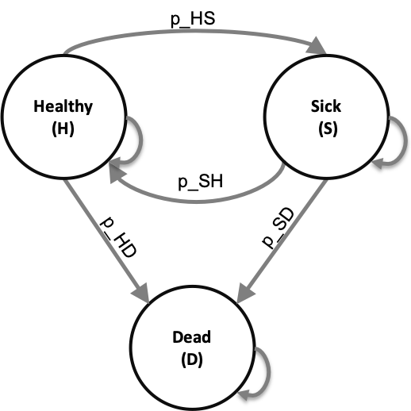
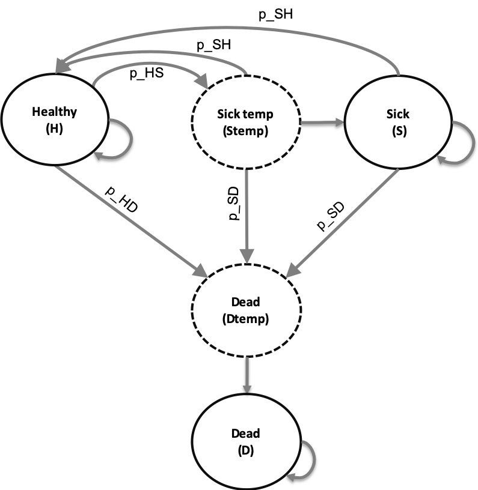

```{r setup, include=FALSE}
knitr::opts_chunk$set(echo = TRUE)
```

```{r, eval = TRUE, echo = FALSE}
###############################################################################
### A brief report   ## 2019 ##
################################################################################
# This code forms the basis for the brief report: 
# 'A multidimensional array representation of state-transition model dynamics' 
# Please cite the article when using this code
################################################################################
# Demonstrate the dynamics-array approach using a stylistic 3-state model 
################################################################################
# To program this tutorial, we made use of 
# R version 3.5.1 (2018-7-02)
# Platform: x86_64-apple-darwin15.6.0 (64-bit)
# Running under: macOS Mojave 10.14
# RStudio: Version 1.1.456 2009-2018 RStudio, Inc
################################################################################
```

## Illustrative 3-state cohort model
In this illustrative example, we follow a cohort of healthy 70-year-old individuals over their remaining lifetime, using 30 annual cycles. The healthy individuals can get sick, they can die or stay healthy. Sick individuals can fully recover, transitioning back to healthy, remain sick or die. The state-transition diagram is shown in Figure \ref{fig:STM}. Remaining in each of these health states is associated with some utilities and costs (the state rewards).  In addition to these state rewards, transition dis-utilities and costs apply. Getting sick is associated with a sudden decrease of quality of life of 0.1. In addition, transitioning to dead incurs a one-time cost of $4,000. Both the state and transition rewards are constant over time. All parameters of this model are fictitious, not based on a specific disease and described in the table below. We use some prefixed to name our variables and we try to use a `<x>_<y>_<varName>` structure as consistent as possible, with x being the data type prefix, e.g. `a_` for arrays, `m_` for matrix, `df_` for data frames etc. and y being the variable type prefix, e.g. `c_` for costs, `p_` for probabilities, `u_` for utilities etc. This coding convention is recommended by our published coding framework (Alarid-Escudero et al., 2019).




|           **Parameter**            |  **R name** |   **Value**   |
|:-----------------------------------|:-----------:|:-------------:|
| Time horizon ($n_t$)               | `n_t`       |  30 years     |
| Names of health states ($n$)       | `v_n`       |  H, S, D      |
| Annual transition probabilities    |             |               |
| - Disease onset (H to S)           | `p_HS`      |  0.30         |
| - Recovery (S to H)                | `p_SH`      |  0.15         |
| Annual mortality                   |             |               |
| - All-cause (H to D)               | `p_HD`      |  0.05         |
| - Disease specific (S to D)        | `p_SD`      |  0.20         |
| Annual costs                       |             |               |
| - Healthy individuals              | `c_H`       |  $1,000       |
| - Sick individuals                 | `c_S`       |  $3,000       |
| - Dead individuals                 | `c_D`       |  $0           |
| Utility weights                    |             |               |
| - Healthy individuals              | `u_H`       |  1.00         |
| - Sick individuals                 | `u_S`       |  0.60         |
| - Dead individuals                 | `u_D`       |  0.00         |
| Transition rewards                 |             |               |
| - Utility decrement of healthy individuals | `du_HS`|  0.10      |
|   when transitioning to S          |             |               |
| - Cost of dying                    | `ic_D`      |  $4,000       |


###01 Initial setup 
We start by loading the packages and functions needed. 
```{r, eval = TRUE, echo = TRUE, message = FALSE, warning = FALSE}
#### 01.1 Load packages and functions ####
library(reshape2) # load reshape2 to transform data
library(ggplot2)  # load ggplot2 for nice looking plots
```

#### 01.2 External parameters
In this section, we specify the staring age of the cohort, the number of cycles, the names of the health states and model parameters.  
```{r, eval = TRUE, echo = TRUE, message = FALSE, warning = FALSE}
#### 01.2.1 General setup ####
age         <- 70  # age of starting cohort
n_t         <- 30  # time horizon, number of cycles
v_age_names <- age:(age + n_t - 1) # vector with age names
v_n <- c("H", "S", "D") # vector with the 3 health states of the model:
# Healthy (H), Sick (S), Dead (D)
n_states <- length(v_n) # number of health states 
```

Next, we store the base-case parameters.
```{r}
#### 01.2.3 Generate initial set of base-case external parameters ####
# Costs
c_H   <- 1000   # cost of remaining one cycle healthy 
c_S   <- 3000   # cost of remaining one cycle sick 
c_D   <- 0      # cost of being dead (per cycle)
# State utilities
u_H   <- 1      # utility when healthy 
u_S   <- 0.60   # utility when sick 
u_D   <- 0      # utility when healthy 
# Transition probabilities (per cycle)
p_HS  <- 0.30   # probability to become sick when healthy
p_HD  <- 0.05   # probability to die when healthy
p_SH  <- 0.15   # probability to become healthy when sick
p_SD  <- 0.20   # probability to die when sick
# Transition rewards
du_HS <- 0.10   # one-time utility decrement when becoming sick
ic_D  <- 4000   # one-time cost of dying
```

### 02 Define and initialize matrices and vectors ####
In this section, we initialize the matrices and vectors used for storing the data. The transition probability matrix, `m_P`, is initialized. The next step is to initialize the state vector `v_m0`. All individuals start healthy. This state vector is used to inform the first row of the cohort trace matrix `m_M`. 

#### Equation 1-2
```{r}
#### 02.1 Initial state vector ####
# the cohort start in the Healthy health state
v_m0 <- c(H = 1, S = 0, D = 0)
v_m0

#### 02.2 Cohort trace  
## Create the Markov cohort trace matrix m_M capturing the proportion of the cohort 
# in each state at each cycle

m_M <- matrix(0,  # initialize cohort trace
              nrow = (n_t + 1), ncol = n_states, 
              dimnames = list(0:n_t, v_n))

m_M[1, ] <- v_m0   # store the initial state vector
```

```{r, message = FALSE, warning = FALSE}
#### 02.3 Transition probability matrix ####
# matrix m_P at the first cycle
m_P <- matrix(NA, 
              nrow = n_states, ncol = n_states, 
              dimnames = list(v_n, v_n))

# Fill in matrix
# From Healthy
m_P["H", "H"]  <- 1 - (p_HS + p_HD)
m_P["H", "S"]  <- p_HS
m_P["H", "D"]  <- p_HD
# From Sick
m_P["S", "H"]  <- p_SH
m_P["S", "S"]  <- 1 - (p_SH + p_SD)
m_P["S", "D"]  <- p_SD
# From Death
m_P["D", "H"]  <- 0
m_P["D", "S"]  <- 0
m_P["D", "D"]  <- 1

m_P # print the transition probability matrix
```

We have determined all parameters for the general set up, we specified our input parameters, initialized all structures and filled the transition probability matrix `m_P` and the first row of our cohort trace `m_M`. The next step is running the Markov model. 

### 03 Traditional cohort trace approach  
In this section, we run the Markov model for the entire time horizon. The calculation shown in Equation 3 needs to be performed for all cycles. Therefore, we create a loop starting at `t = 1` until `t = n_t`. The transition probability matrix, `m_P` is multiplied with the cohort trace `m_M[t, ]`, using matrix multiplication, specified in `R` with `%*%`, to fill the next row of the `m_M[t + 1, ]`. 

#### Equation 3 
```{r, message = FALSE, warning = FALSE}
for(t in 1:n_t){  # loop through the number of cycles
  # estimate the state vector for the next cycle (t + 1)
  m_M[t + 1, ] <- m_M[t, ] %*% m_P   
}
```

#### Equation 4
When printing the first six rows of `m_M` we see that everyone starts healthy and over time the cohort transitions towards sick and dead. 
```{r}
head(round(m_M, 3)) # show the first six lines of the cohort trace
```
Running the model using equation 3, results in the traditional cohort trace. This gives information about state occupation at each cycle and allows us to apply state rewards (e.g. `c_H`, `u_H`, etc.), but it is not possible to include the transition rewards (e.g. `du_HS` and `ic_D`). In order to include these rewards, we need to know when individuals made the transition. The dynamics-array approach facilitates this and will be explained in the next section. 

### 04 Dynamics-array approach  
The dynamics-array approach starts similar as the traditional cohort trace approach, meaning that the first two sections are identical for the two approaches. The biggest difference is the additional array structure of dimensions `n_states` x `n_states` x `n_t` to store the transition dynamics. In `R` indexing start at 1, therefore, we initialize the array `a_A` using `n_state` + 1. This allows us to store the results from cycle 0 until cycle `n_t`. The initial state vectors `v_m0` is used to inform the initial cycle of the array. 

#### Equation 5
```{r, message = FALSE, warning = FALSE}
a_A <- array(0, dim = c(n_states, n_states, n_t + 1),
             dimnames = list(v_n, v_n, 0:n_t)) # initialize array
diag(a_A[, , 1]) <- v_m0 # store the initial state vector in the diagonal of A
a_A[, , 1] # print the first cycle
```

#### Equation 6
Now we run the model using the dynamics-array approach. In this approach, iteratively over time, we multiply the transition probability matrix `m_P` with array `a_A` using element-wise multiplication, indicated with the `*` in `R`. The information about all transitions is stored in the `t + 1`-th "slice" of `a_A`.  
```{r, message = FALSE, warning = FALSE}
# run the model 
for(t in 1:n_t){                     # loop through the number of cycles
  a_A[, , t + 1] <- colSums(a_A[, , t]) * m_P  # estimate the transition dynamics at t + 1
}
```

#### Equation 7 and 8
Printing the first thee cycles of the dynamics-array `a_A` gives an impression of the results. Like in the transition probability matrix `m_P`, the rows specify in which health state the individual started at the beginning of the cycle, while the columns inform you about where individuals transitioned to. In cycle 0 everyone started in the healthy states. At cycle 1 we can see that the values look very similar to the transition probabilities. From cycle 2 and onwards the information in `a_A` becomes more interesting. In cycle 2, we see that `r a_A["H", "H", 2]` of the cohort stayed healthy, `r a_A["H", "S", 2]` transitioned from healthy towards sick and `r a_A["H", "D", 2]` of the population died. In addition, we see that `r a_A["S", "H", 2]` of the cohort recovered, `r a_A["S", "S", 2]` stayed Sick and `r a_A["H", "D", 2]` died from Sick. All these values sum to 1 since we are still describing what happens to the full cohort over time. 

```{r, message = FALSE, warning = FALSE}
a_A[, , 1:3] # shown for two cycles
sum(a_A[, , 3]) # sum for t = 3
```

When you sum the values in each column of `a_A`, the health states towards which the individuals transition to, you get which proportion of the cohort was in each health state for that cycle. The code below shows this for the health state sick. 
```{r}
sum(a_A[, "S", 3]) # sum the column of S at t = 3
```

#### Equation 9
We can obtain `m_M` from `a_A` by summing the values in each column of `a_A` for all points in time. By transposing this in turn, we get the traditional cohort trace `m_M`. I order to compare this matrix with the directly generated `m_M` via equation 3 we name it, `m_M_A`. 
```{r, message = FALSE, warning = FALSE}
# recovering M from A 
m_MViaA <- t(colSums(a_A))   # sum over the columns of a_A and transpose 
```

Since a Markov model is stochastic, the cohort trace obtained from `a_A` should be identical to `m_M`. We check this using the `==` function. We use rounding on 10 decimals, to avoid wrong `FALSE` results that have to do with floating point comparison issues.

```{r, eval = FALSE, echo = FALSE}
round(m_M, 10) == round(m_MViaA, 10) # check if they are exactly the same
```


### 05 Apply state and transition rewards 
By now you know how to run a state-transition cohort model using the dynamics-array approach and how to interpret or summarize the results. In this section, we demonstrate how to apply state and transition rewards. We start by initiating and filling two matrices for both costs and effects. On the diagonal are the costs for staying one cycle in that state (state rewards), while the costs off the diagonal are the costs for staying one cycle in that state plus the transition cost associated with that transition (transition rewards).

#### Equation 10
```{r, message = FALSE, warning = FALSE}
#### 05.1 Create reward matrices for both costs and effects #### 
m_R_costs <- m_R_effects <- matrix(NA, 
                  nrow = n_states, ncol = n_states, 
                  dimnames = list(v_n, v_n))
    
# Fill in matrix for costs
# To Healthy
m_R_costs["H", "H"]  <- c_H
m_R_costs["S", "H"]  <- c_H 
m_R_costs["D", "H"]  <- c_H 
# To Sick
m_R_costs["H", "S"]  <- c_S
m_R_costs["S", "S"]  <- c_S 
m_R_costs["D", "S"]  <- c_S 
# To Death
m_R_costs["H", "D"]  <- c_D + ic_D
m_R_costs["S", "D"]  <- c_D + ic_D
m_R_costs["D", "D"]  <- c_D 

# Fill in matrix for effects
# To Healthy
m_R_effects["H", "H"]  <- u_H
m_R_effects["S", "H"]  <- u_H 
m_R_effects["D", "H"]  <- u_H 
# To Sick
m_R_effects["H", "S"]  <- u_S - du_HS
m_R_effects["S", "S"]  <- u_S 
m_R_effects["D", "S"]  <- u_S 
# to Death
m_R_effects["H", "D"]  <- u_D
m_R_effects["S", "D"]  <- u_D
m_R_effects["D", "D"]  <- u_D 
```

These rewards matrices look as follow. We see that staying healthy costs \$1000, while someone that transitions from healthy towards dead makes costs of \$5000. In the effects matrix we see that an individual gets a utility of 1 assign for staying healthy, while when the individual transitions towards Sick the decrement of `ic_HS` is included, resulting in a utility of 0.90.

```{r, message = FALSE, warning = FALSE}
m_R_costs    # show the reward matrix for costs
m_R_effects  # show the reward matrix for effects
```

#### Equation 12 
In this section we create outcome arrays, `a_Y`, one for costs, `a_Y_costs`, and one for effects,`a_Y_effects`. These arrays show the costs and QALYs generated with each transition at each cycle. By iteratively element-wise multiplication of the reward matrices, `m_R_costs` and `m_R_effects`, with array `a_A` we can fill the outcome arrays.
```{r, message = FALSE, warning = FALSE}
#### 05.2 Expected QALYs and Costs per cycle for each strategy ####
a_Y_costs <- a_Y_effects <- array(0, dim = c(n_states, n_states, n_t + 1),
             dimnames = list(v_n, v_n, 0:n_t))

# initialize arrays 
a_Y_costs[, , 1]   <- a_A[, , 1] * m_R_costs  
a_Y_effects[, , 1] <- a_A[, , 1] * m_R_effects  

for(t in 1:n_t){ 
# element-wise-multiplication of array A with the rewards matrices
a_Y_costs[, , t + 1]   <- a_A[, , t + 1] * m_R_costs   
a_Y_effects[, , t + 1] <- a_A[, , t + 1] * m_R_effects 
}
```

Please note that we are now showing all these calculations in a step-wise approach, resulting in having a couple of loops for time. All iterative process, creating `m_M`, `a_A` and the `m_R` and `a_Y`, can be combined within the same loop for time. 

#### Equation 12
The final step is to calculate the total costs and QALYs. We first calculate the expected cost and QALYs per cycle and store them in the vectors `v_costs` and `v_QALYs`. Then, we sum the values within each vector to compute the total expected cost (`TC`) and QALYs (`TE`). 
```{r, message = FALSE, warning = FALSE}
# calculate the expected costs per cycle
v_costs <- rowSums(t(colSums(a_Y_costs))) 
# calculate the expected QALYs per cycle
v_QALYs <- rowSums(t(colSums(a_Y_effects))) 

TC <- sum(v_costs)  # calculate the total expected costs
TE <- sum(v_QALYs)  # calculate the total expected QALYS

v_results <- c(TC, TE)       # combine the total expected costs and QALYs
names(v_results) <- c("Costs", "Effect") # name the vector
v_results                    # print the results  
```


### 06 Plot cohort trace
The results of a cohort trace are much easier to interpret via a graph. Using the function `ggplot` we show the proportion of the cohort in each state (y-axis) at each cycle (x-axis) in Figure \ref{fig:cohort-trace}.
```{r cohort-trace, fig.width = 7, fig.height = 4, fig.align = 'center', fig.pos = "h", echo = FALSE, fig.cap = 'Cohort trace of the model', message = FALSE, warning = FALSE} 
ggplot(melt(m_M), aes(x = Var1, y = value, color = Var2)) +
  geom_line(size = 1.3) +
  scale_color_discrete(l = 50, name = "Health state", h = c(45, 365)) +
  xlab("Cycle") +
  ylab("Proportion of the cohort") +
  ggtitle("Cohort trace of the stylistic 3-state model") +
  theme_bw(base_size = 16) +
  scale_x_continuous(name = "Cycles", limits = c(0, n_t), 
                     breaks = seq(0, n_t, 10)) +
  theme()
```

At the end of the model we save the important objects so they can be used without the need to run the model again. 
```{r}
save(m_M, file = "../output/cohort_trace.RData") # save the object 
save(a_A, file = "../output/array.RData") # save the object 
```

### 07 Estimation of epidemiological measures
As mentioned in the brief report, full exposition of computing epidemiological measures from array A is case-specific and is beyond the scope of this brief report. We do however, like to illustrate the concept using a very simple example. For our illustrative 3-state model we can calculate the ratio of those than transitioned from sick to dead at each cycle to those that transitioned to dead from healthy and sick. To calculate this, we initiate a vector of lenght $n_t$ to store the data and since all individuals start out healthy the initial value of this vector is 0. Next, we iteratively calculate the ratio.

```{r}
v_e <- numeric(n_t + 1)   # create the vector v_e
v_e[1] <- 0               # initiate the vector
# calculate the ratio across all cycles starting in cycle 2
v_e[-1] <-  a_A["S", "D", -1] / (a_A["H", "D", -1] +  a_A["S", "D", -1])
```

Next, we prepare the data to get a nice plot. 
```{r}
df_e <- as.data.frame(cbind(0:n_t, v_e)) # create a dataframe with cycles and proportion that dies each cycle
colnames(df_e) <- c("cycle", "proportion") # name the columns of the dataframe
```


```{r dead ratio, fig.width = 7, fig.height = 4, fig.align = 'center', fig.pos = "h", echo = FALSE, fig.cap = 'Ratio of those dying from sick to those dying from both healthy and sick', message = FALSE, warning = FALSE} 
### Plot ratio
ggplot(df_e, aes(x = cycle, y = proportion)) +
  geom_line(size = 1.3) +
  scale_color_discrete(l = 50, name = "Health state", h = c(45, 365)) +
  xlab("Cycle") +
  ylab("Ratio deaths from sick to al deaths vs to all deaths") +
  ggtitle("Ratio deaths from sick to all deaths") +
  theme_bw(base_size = 16) +
  scale_x_continuous(name = "Cycles", limits = c(0, n_t), breaks = seq(0, n_t, 10)) +
  scale_y_continuous(name = "Ratio S->D vs to all deaths", limits = c(0, 1)) +
  theme()
```

Our final step is to save the figure in the figs folder. 
```{r}
ggsave("../figs/Proportion_death_from_sick.png", width = 8, height = 6) # save the plot
``` 

\newpage

## Using the traditional cohort trace approach
With the tranditional approach the Markov trace is calculated every cycle. This trace only shows how the cohort is distributed among the different health states over time, but no information about the transitions is available. In our stylistic 3-state model getting sick is associated with a sudden decrease of quality of life of 0.1 and in addition transitioning to dead incurs a one-time cost of \$4,000. To incorporate these rewards we need to make two extra temporary health states. One temporary states for those that transitioned to sick, Stemp, and one temporary state for those that die, Dtemp. The Stemp state makes is possible to incorporate the sudden decrease of quality of life and the Dtemp states is used to incorporate the extra cost. This means that with the traditional approach our model would have five health states: Healthy, Sick temporary, Sick, Dead temporary and Dead (see Figure \ref{fig:STM-cohort}). The healthy individuals can transition to sick temporary state, dead temporary state or stay healthy. Temporary sick individuals, those that just turned sick, can fully recover, transitioning back to healthy, transition to the Dead temporary state or remain sick, which means that they transition to Sick. Sick individuals, can also fully recover, transitioning back to healthy, can transition to dead temporary or stay sick, which means they remain in the sick state. All individuals in the temporary dead state transition to the dead states. The dead state is the absorbing states.   



In the next sections we describe how to run the model using the traditional cohort trace approach. All parameters are similar we and only provide code for parts that are different compared to the dynamics array appraoch 

### Extra temporary health states

For this model we need two temporary health state in addition to the 3 main states of the model. A temporary health state is a state in which an individual can only stay for one cycle. After one cycle the individual has to transition to a new cycle. A temporary health state for sick is needed to be able to apply the sudden decrease of utility for individuals that transition from healthy to dead. We call this health state sick temporary, in short Stemp. In addition, a temporary health state for dead is needed in order to apply the costs associated with this transition. This health state is called Dtemp. This means that the tranditional cohort trace approach has five health states compared with 3 in the array appraoch. 
```{r}
v_n <- c("H", "Stemp", "S", "Dtemp", "D") # vector with the 3 health states of the model:
# Healthy (H), Sick (S), Dead (D) and two temporary health states one for Sick for the first time (Stemp) and one for dying (Dtemp)
n_states <- length(v_n) # number of health states 
```

The transition probability matrix now has `r n_states` and `r n_states` columns.

```{r}
#### Transition probability matrix ####
# matrix m_P at the first cycle
m_P <- matrix(NA, 
              nrow = n_states, 
              ncol = n_states, 
              dimnames = list(v_n, v_n))
```

The matrix is filled in a similar way compared to the array appraoch described above. Healthy individuals can only transition to the temporary sick, Stemp, or dead, Dtemp, state or they stay healthy. Healthy inidviduals can not transtion to sick, S, or dead, D. 

```{r}
# Fill in matrix
# From Healthy
m_P["H", "H"]      <- 1 - (p_HS + p_HD)
m_P["H", "Stemp"]  <- p_HS
m_P["H", "S"]      <- 0
m_P["H", "Dtemp"]  <- p_HD
m_P["H", "D"]      <- 0

# From Sick temporary (first cycle being sick)
m_P["Stemp", "H"]     <- p_SH
m_P["Stemp", "Stemp"] <- 0
m_P["Stemp", "S"]     <- 1 - (p_SH + p_SD)
m_P["Stemp", "Dtemp"] <- p_SD
m_P["Stemp", "D"]     <- 0

# From Sick
m_P["S", "H"]         <- p_SH
m_P["S", "Stemp"]     <- 0
m_P["S", "S"]         <- 1 - (p_SH + p_SD)
m_P["S", "Dtemp"]     <- p_SD
m_P["S", "D"]         <- 0

# From Death temporary
m_P["Dtemp", "H"]     <- 0
m_P["Dtemp", "Stemp"] <- 0
m_P["Dtemp", "S"]     <- 0
m_P["Dtemp", "Dtemp"] <- 0
m_P["Dtemp", "D"]     <- 1

# From Death
m_P["D", "H"]         <- 0
m_P["D", "Stemp"]     <- 0
m_P["D", "S"]         <- 0
m_P["D", "Dtemp"]     <- 0
m_P["D", "D"]         <- 1

m_P # print the matrix 
```

All individuals in the cohort start out healthy and this information is stored in the Markov cohort trace. 
```{r}
#### Cohort trace matrix ####
## Initial state vector
v_m0 <- c(H = 1, Stemp = 0, S = 0, D = 0, Dtemp = 0) # the cohort starts healthy

## Create the Markov cohort trace matrix m_M that captures the proportion of the cohort in each state at each cycle
m_M <- matrix(0, 
              nrow = (n_t + 1), 
              ncol = n_states, 
              dimnames = list(0:n_t, v_n)) # initialize cohort trace matrix 
m_M[1, ] <- v_m0 # store the initial state vector in the first row of the cohort trace
```

Now we iteratively run the model
```{r}
#### Run the cSTM ####
for(t in 1:n_t){  # loop through the number of cycles
  # estimate the state vector for the next cycle (t + 1)
  m_M[t + 1, ] <- m_M[t, ] %*% m_P    
}

head(m_M)
```


While the array approach requiers an matrix to apply the rewards, with the traditional cohort approach two vectors are enough. One vector for the utilities and one for the costs is created. The costs of dying, `ic_D` of values \$`r ic_D` is applies to the proportion of the cohort in the temporary dead state. This are the individuals that just died and made those costs. The utility decrement `du_HS` is substracted from the utily of being sick in the temporary health state. That is the proportion of the cohort that just transitioned from healthy to sick. 

```{r}
#### State and transition rewards ####
## Create a vector to store rewards
v_R_costs   <- c(c_H, c_S, c_S, c_D + ic_D, c_D)
v_R_effects <- c(u_H, u_S - du_HS, u_S, u_D, u_D)
names(v_R_costs) <- names(v_R_effects) <- v_n
```

The expected QALYs and costs per cycle in turn can be calculated by matrix multiplication of `m_M` with the vector for costs `v_R_costs` and `v_R_effects`. 
```{r}
#### Aggregate outcomes ####
v_costs <- m_M %*% v_R_costs          # calculate the expected costs per cycle
v_QALYs <- m_M %*% v_R_effects        # calculate the expected QALYs per cycle

TC <- sum(v_costs)                    # calculate the total expected costs
TE <- sum(v_QALYs)                    # calculate the total expected QALYS
v_results <- c(TC, TE)                # combine the total expected costs and QALYs
names(v_results) <- c("Costs", "Effect")  # name the vector
v_results                             # print the results  
```

\newpage
## References
Alarid-Escudero, Fernando et al. 2019. “A Need for Change! A Coding Framework for Improving Transparency in Decision Modeling.” PharmacoEconomics. https://doi.org/10.1007/s40273-019-00837-x.