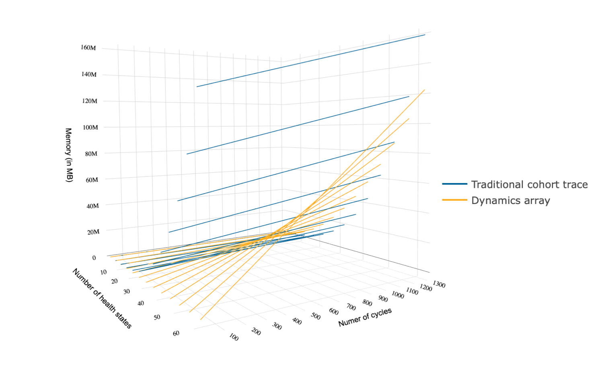

**Explanation of the simulation study**

We conducted a simulation study on computation efficiency of the two methods using the `R` software. The computation time in seconds and the computation storage in megabytes (MB) of the two methods were compared. The parameters that were varied were the number of states and the number of cycles in our cohort model. The number of states varied from 2 to 62, incremented by 5, while the number of cycles varied from 12 to 1320, incremented by 12. The minimum number of states in a cohort model is 2 and a cohort model with more than 60 states is not very common, and should there be more than 60 states alternative approaches such as microsimulation models are often used instead. The number of months in 110 years (modelling an individual's lifetime) is 1320, and an increment of 12 cycles represents annual incrementation.

In order to capture and calculate transition and state rewards using the cohort trace approach, temporary states had to be created, since the transition reward for a state is only obtained when it is first visited. Without loss of generality, we assume there are no absorbing states and every state can be visited from any other state. Also, the transition probability matrices for both approaches were randomly sampled such that each entry is between 0 and 1 and each row adds up to 1. The rewards vectors and matrices for both approaches were also randomly sampled from appropriate distributions. We set the seed of `R`’s random number generator to assure reproducible results.

At 1320 cycles, as the number of states increases, the run time of the cohort trace approach increases almost exponentially while that of the array approach stays invariant, and significantly less. Looking at the three-dimensional figure that illustrates how computation time of the two approaches vary as the number of health states and the number of cycles increase simultaneously. The figure shows that the run time of the cohort trace approach increases when either the number of health states or the number of cycles increases. On the contrary, the run time of the array approach is significantly less and is invariant to increases in either the number of health states nor the number of cycles. 


At 1320 cycles, as the number of health states increases, the storage of both approaches increases. When the number of health states is less than approximately 52, the cohort trace approach takes up less storage. But when the number of health states is above approximately 52, it takes up more storage. Looking at the three-dimensional figure that illustrates how computation storage of the two approaches vary as the number of health states and the number of cycles increase simultaneously. We see that the storage increases as when either the number of health states or the number of cycles increases. Both approaches take up approximately the same amount of storage before around 50 health states. After 50 health states the cohort trace approach takes up more memory compared to the array approach.


Based on the results of our simulation study, we conclude that the array approach is computationally superior to the cohort trace approach. It is much faster and does not run any slower when the number of cycles or the number of health states increases. In addition, it takes up less storage as the number of states becomes sufficiently large. All code of the simulation study and to make the figures can be found on
 
**Compare time:**

2D line graph - by state, at 1320 cycles

```{r, echo = FALSE, eval = TRUE, warning = FALSE, cache = TRUE, message = FALSE}
library(plotly)
library(ggplot2)
library(DataCombine)
library(darthpack)
library(dampack)
library(reshape2)

# code for the DARTH colors for the figures
DARTHyellow <- '#009999'  
DARTHgreen  <- '#FDAD1E'   
v_colors <- c(DARTHyellow, DARTHgreen)

number_ticks <- function(n) {function(limits) pretty(limits, n)} #Function for number of ticks in ggplot

time_mem_both <- read.csv('time_memory_comparisons_more_cycles.csv', 
                     header = TRUE, stringsAsFactors = FALSE)
time_mem_both$method[time_mem_both$method == "cohort trace"] <- "Traditional cohort trace"
time_mem_both$method[time_mem_both$method == "array"] <- "Dynamics array"
names(time_mem_both)[names(time_mem_both) == "method"] <- "approach"
time_mem_both_2D <- time_mem_both[time_mem_both$n_t == 1320, ]

# Create a graph showing the computational time of both approaches
ggplot(data = time_mem_both_2D, aes(x = n_states, y = time, group = approach)) + 
  geom_point(aes(color = approach, shape = approach)) +
  geom_line(aes(color = approach)) + 
  ggtitle("Computation time simulation analysis") +
  xlab("Number of health states") + 
  ylab("Time ( in seconds)") +
  theme_bw(base_size = 16) + theme(legend.position = "bottom") +
    scale_y_continuous(breaks = number_ticks(7)) +
    scale_x_continuous(breaks = number_ticks(6)) +
    scale_color_manual(values = c(DARTHgreen, DARTHyellow)) 

ggsave("../figs/2D_time.png")
```


**Zoom in on the y-axis**

2D line graph - by state, at 1320 cycles zoomed in on the y-axis to see time changes of the array approach
```{r, echo = FALSE, eval = TRUE, warning = FALSE, cache = TRUE, message = FALSE}
# Create a graph to zoom in on the y-axis to see the change in time for the array method
ggplot(data = time_mem_both_2D, aes(x = n_states, y = time, group = approach)) + 
  geom_point(aes(color = approach, shape = approach)) +
  geom_line(aes(color = approach)) + 
  ggtitle("Computation time simulation analysis") +
  xlab("Number of health states") + 
  ylab("Time ( in seconds)") +
  scale_y_continuous(limits = c(0, 2)) +
  theme_bw(base_size = 16) + theme(legend.position = "bottom") +
    scale_y_continuous(breaks = number_ticks(7)) +
    scale_x_continuous(breaks = number_ticks(6)) +
    scale_color_manual(values = c(DARTHgreen, DARTHyellow)) 

ggsave("../figs/2D_time_zoom.png")
```


3D Scatter plot:

```{r, echo = FALSE, eval = TRUE, warning = FALSE, cache = TRUE, message = FALSE, include = FALSE}
time_mem_both_3D <- time_mem_both

# insert NAs so the lines are not connected on the graph
index <- 1:length(seq(from = 110, to = 2860, by = 110))
j <- 0
for (i in seq(from = 110, to = 2860, by = 110)) {
  j <- j + 1
  time_mem_both_3D <- InsertRow(time_mem_both_3D, rep(NA,5), RowNum = i + index[j])
}

axy <- list(
  nticks = 14,
  range = c(3, 1320)
)

f1 <- list(
  family = "Arial, sans-serif",
  size = 12,
  color = "black")

f2 <- list(
  family = "Old Standard TT, serif",
  size = 11,
  color = "black")

axis <- list(
  titlefont = f1,
  tickfont = f2,
  showgrid = TRUE
)

scene = list(
  xaxis = axis,
  yaxis = axis,
  zaxis = axis)

time_mem_trace <- time_mem_both_3D[time_mem_both_3D$method == 'cohort trace', ]
time_mem_array <- time_mem_both_3D[time_mem_both_3D$method == 'array', ]

p <- plot_ly(x = time_mem_trace$n_states, y = time_mem_trace$n_t, z = time_mem_trace$time, type = 'scatter3d', mode = 'lines', name = 'Traditional cohort trace', line = list(color = '#FDAD1E'), connectgaps = FALSE) %>% layout(scene = list(yaxis = axy)) %>%
layout(scene = list(
       xaxis = list(title = "Number of health states"),
       yaxis = list(title = "Number of cycles"),
       zaxis = list(title = "Time (in seconds)"))) %>% layout(scene = scene)

p %>% add_trace(x = time_mem_array$n_states, y = time_mem_array$n_t, z = time_mem_array$time, type = 'scatter3d', mode = 'lines', name = 'Dynamics array', line = list(color = '#009999'), connectgaps = FALSE) 
```

```{r, echo = FALSE, eval = TRUE, warning = FALSE, cache = TRUE, message = FALSE, out.width = '100%'}
#knitr::include_graphics("../figs/3D_time.png")
```


```{r,echo=F,eval=T,warning=FALSE,cache=T, message=F, include = T}
time_mem_both_3D <- time_mem_both

# insert NAs so the lines are not connected on the graph
index <- 1:length(seq(from=110, to=2860, by=110))
j <- 0
for (i in seq(from=110, to=2860, by=110)) {
  j <- j + 1
  time_mem_both_3D <- InsertRow(time_mem_both_3D, rep(NA,5), RowNum = i+index[j])
}

axy <- list(
  nticks = 14,
  range = c(3,1320)
)

f1 <- list(
  family = "Arial, sans-serif",
  size = 12,
  color = "black")

f2 <- list(
  family = "Old Standard TT, serif",
  size = 11,
  color = "black")

axis <- list(
  titlefont = f1,
  tickfont = f2,
  showgrid = T
)

scene = list(
  xaxis = axis,
  yaxis = axis,
  zaxis = axis)

time_mem_trace <- time_mem_both_3D[time_mem_both_3D$method == 'cohort trace',]
time_mem_array <- time_mem_both_3D[time_mem_both_3D$method == 'array',]

p <- plot_ly(x = time_mem_trace$n_states, y = time_mem_trace$n_t, z = time_mem_trace$time, type='scatter3d', mode='lines', name = 'Traditional cohort trace', line = list(color = '#FDAD1E'), connectgaps = F) %>% layout(scene = list(yaxis = axy)) %>%
layout(scene = list(
       xaxis = list(title = "Number of health states"),
       yaxis = list(title = "Number of cycles"),
       zaxis = list(title = "Time (in secs)"))) %>% layout(scene=scene)

p %>% add_trace(x = time_mem_array$n_states, y = time_mem_array$n_t, z = time_mem_array$time, type='scatter3d', mode = 'lines', name = 'Dynamics array', line = list(color = '#009999'), connectgaps = FALSE) 
```


**Compare storage:**

2D line graph - by state, at 1320 cycles

```{r, echo = FALSE, eval = TRUE, warning = FALSE, cache = TRUE, message = FALSE}
options(scipen = 999)
ggplot(data = time_mem_both_2D, aes(x = n_states, y = memory/1000000, group = approach))+  
  geom_point(aes(color = approach, shape = approach)) +
  geom_line(aes(color = approach)) +
  ggtitle("Computation memory of comparison") +
  xlab("Number of health states") + 
  ylab("Memory (in MB)") +
    scale_y_continuous(breaks = number_ticks(7)) +
    scale_x_continuous(breaks = number_ticks(6)) +
    scale_color_manual(values = c(DARTHyellow, DARTHgreen)) +
    theme_bw(base_size = 16) + theme(legend.position = "bottom")
  
ggsave("../figs/2D_memory.png")
```


3D Scatter plot:


```{r, echo = FALSE, eval = TRUE, warning = FALSE, cache = TRUE, message = FALSE, include = F}
p1 <- plot_ly(x = time_mem_trace$n_states, y = time_mem_trace$n_t, z = time_mem_trace$memory, type = 'scatter3d', mode = 'lines', name = 'Traditional cohort trace', line = list(color = '#FDAD1E'), connectgaps = FALSE) %>% layout(scene = list(yaxis = axy)) %>%
layout(scene = list(
      xaxis = list(title = "Number of health states"),
      yaxis = list(title = "Numer of cycles"),
      zaxis = list(title = "Memory (in MB)"))) %>% layout(scene=scene)

p1 %>% add_trace(x = time_mem_array$n_states, y = time_mem_array$n_t, z = time_mem_array$memory, type = 'scatter3d', mode = 'lines', name = 'Dynamics array', line = list(color = '#009999'), connectgaps = FALSE) 
```

```{r, echo = FALSE, eval = TRUE, warning = FALSE, cache = TRUE, message = FALSE, out.width = '100%'}

```


2D combined plots:

```{r, echo = FALSE, eval = TRUE, warning = FALSE, cache = TRUE, message = FALSE}
time_mem_both_2D[, "Time (in seconds)"] <- time_mem_both_2D$time
time_mem_both_2D[, "Memory (in MB)"] <- time_mem_both_2D$memory/1000000
time_mem_both_2D_new <- melt(time_mem_both_2D[, ! names(time_mem_both_2D) %in% c("time", "memory")], id.vars = c("approach", "n_states", "n_t"))

options(scipen = 999)

ggplot(time_mem_both_2D_new, aes(x = n_states, value)) +
  geom_point(aes(color = approach, shape = approach)) + 
  geom_line(aes(color = approach)) +
  scale_y_continuous(breaks = number_ticks(7)) +
  scale_x_continuous(breaks = number_ticks(6)) +
  xlab("Number of health states") + 
  ylab("") +
  scale_color_manual(values = c(DARTHyellow, DARTHgreen)) +
  facet_wrap(~ variable, scales ="free_y") +
  theme_bw(base_size = 16) + theme(legend.position = "bottom")

ggsave("../figs/2D_time_memory.png")

```